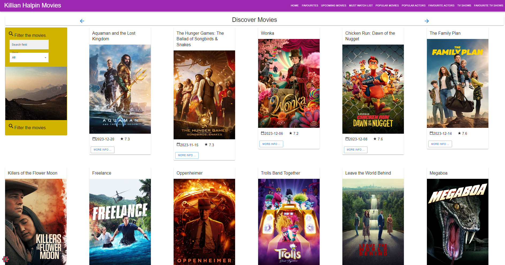
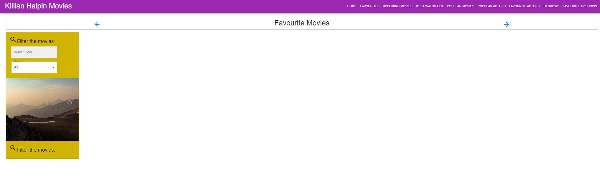
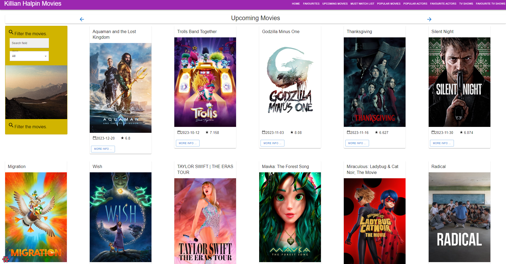
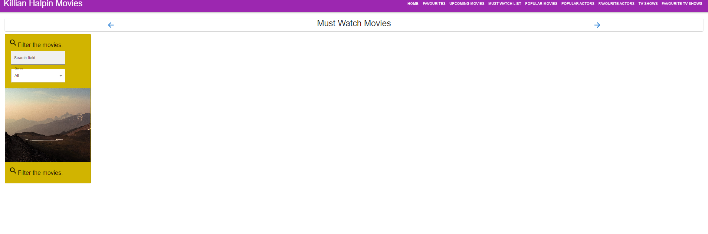
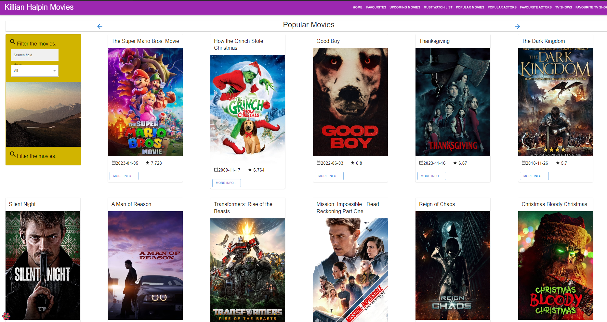
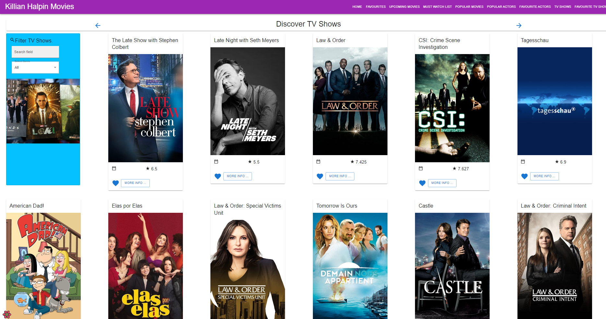
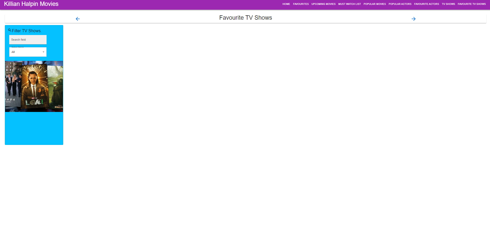

<<<<<<< HEAD
# WAD2-moviesapp
WAD2-moviesapp
=======
# moviesapp-ci-2021

## Name:
Killian Halpin Movies

## Description
This project can display a list of movies and Tv shows and give more detailed information about them. For movies you can add movies to favourites and must watch however the favourites icon is not working on the movies page. For TV shows you can add them to favourites and leave a review, you can also take a TV show out of favourites as well. You can also filter movies and TV shows by genre. 

## Bugs
The reason for the favourites not working I'm assuming is down to an error with this line of code   <CardActions disableSpacing>
    {action(tvShow)} when leaving it in on the movieCard/index.js the developer tools on chrome give me an error saying this action is not a function. However it works with the tvshows card. Movies also show up twice on homepage. 

.

## Authors and acknowledgment
Show your appreciation to those who have contributed to the project.

## Some Images

## Actors
Actors is not working.

>>>>>>> 563f55d0b104a39a6303fc6931294d089a176a23
